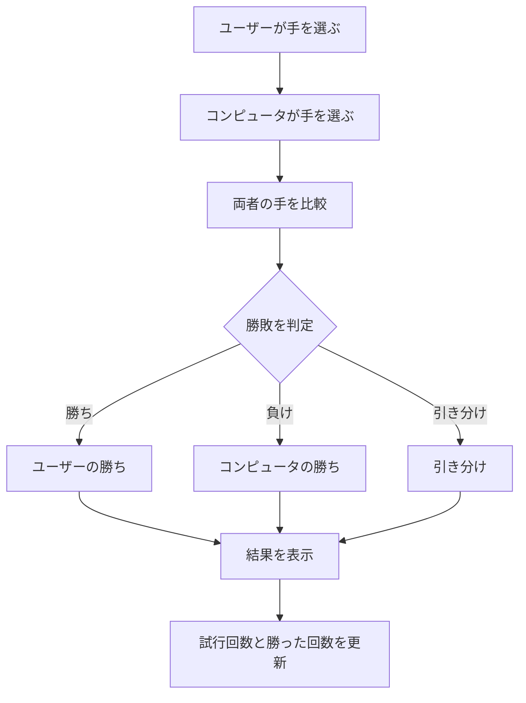
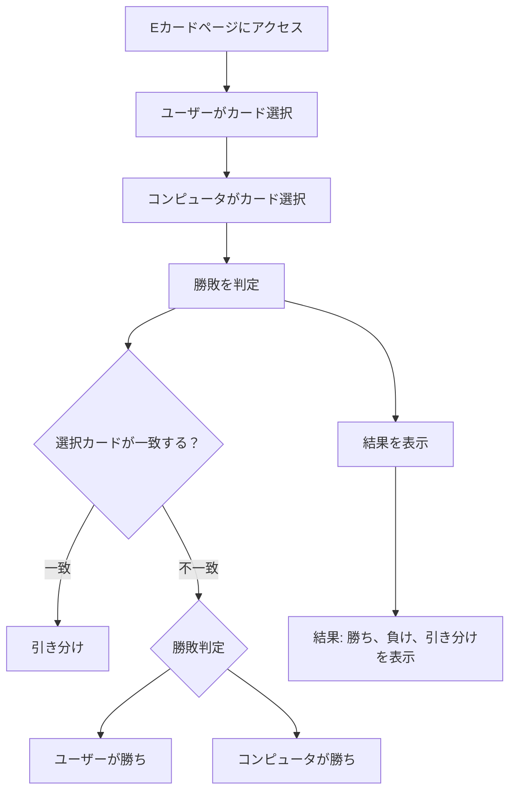
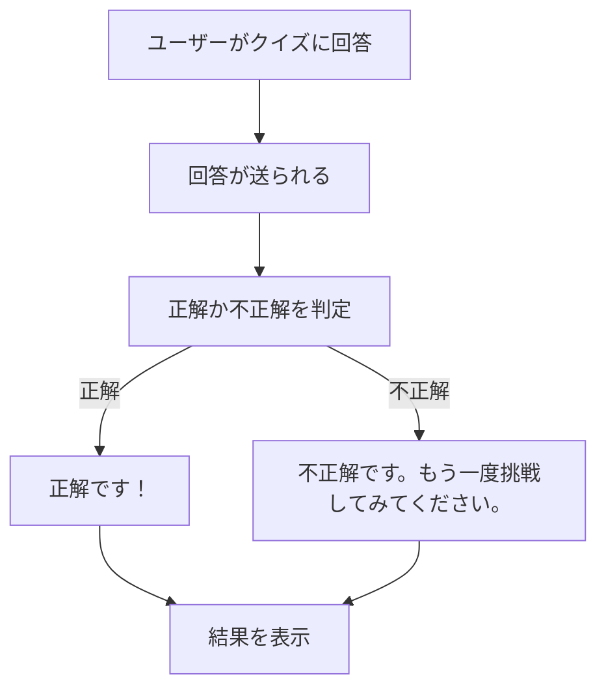

# webpro_06

## app5.jsについて

### 起動方法 
##### 1.リポジトリのクローン  
gitコマンドを利用し，ソースコードをクローンする。
```
git clone https://github.com/username/app5.git
cd app5
```
##### 2.パッケージのインストール
 アプリケーションが正しく動作するために必要なライブラリをインストールする。インストールが完了したら、ディレクトリの中にnode_modulesというフォルダが作成されていることを確認する。
 ```
 npm install
 ```

##### 3.サーバーの起動
 Node.jsがapp5.jsを実行し、アプリケーションのサーバーが起動する。
 ```
node app5.js
 ```
 成功していることを以下のメッセージが表示されているかで確認する。
```
 Example app listening on port 8080!
```
## 機能一覧

##### 1.Hello World ページ (/hello1, /hello2)
この機能は、「Hello world」や「Bon jour」といった簡単なメッセージを表示する。ブラウザで （http://localhost:8080/hello1） または （http://localhost:8080/hello2） にアクセスすると、どちらのURLでも同じメッセージが表示される。

##### 2.アイコン表示 (/icon)
このページでは、Appleのロゴ画像を表示する。ブラウザで （http://localhost:8080/icon） にアクセスすることで、Appleのロゴが表示される。

##### 3.運勢占い (/luck)
この機能では、ランダムで運勢を決定し、その結果を表示する。ブラウザで （http://localhost:8080/luck） にアクセスすると、ランダムに選ばれた運勢が表示される。運勢はページを再読み込みするたびに変動する。

##### 4.じゃんけんゲーム (/janken)
このページでは、プレイヤーが「グー」「チョキ」「パー」を選び、コンピュータとじゃんけんを行う。使用方法としてブラウザで （http://localhost:8080/janken）　にアクセスする。hand がプレイヤーの手、win はプレイヤーの勝ち数、total は試行回数を示す。ゲームの結果が表示され、試行回数と勝ち数も更新される。

##### 5.Eカード対戦 (/ecard)
プレイヤーとコンピュータがカードを使って対戦する。使用できるカードは「皇帝」「市民」「奴隷」の3種類だ。ブラウザで （http://localhost:8080/ecard） に、アクセスする。プレイヤーとコンピュータがカードを選び、カードの強さに基づいて勝敗が決まる。「皇帝」は「市民」に勝ち、「市民」は「奴隷」に勝ち、「奴隷」は「皇帝」に勝つというルールだ。

##### 6.クイズ (/quiz と /quiz/result)
この機能では、ユーザーにクイズを出題し、正解か不正解かを判定する。ブラウザで （http://localhost:8080/quiz） にアクセスすると、クイズが表示される。ユーザーが回答を選択し、回答はURLとして送信される。送信された答えが正解か不正解かを判定し、その結果を表示していく。正解の場合は「正解です！」、不正解の場合は「不正解です。もう一度挑戦してみてください」というメッセージが表示される。


### フローチャート（じゃんけんゲーム）

### フローチャート（Eカード）


### フローチャート（クイズ）

### 　gitの管理
1.変更のステージ
カレントディレクトリとそのサブディレクトリにある変更された全てのファイルをステージングエリアというコミットする前の領域に追加する。
```
git add .
```

2.変更をコミット
ステージングエリアに追加された変更を ローカルリポジトリにコミットするためのコマンドである。-mオプションを使うことで、コミットにメッセージを付けることができる。
```
git commit -m "変更内容"
```
3.リポジトリへのプッシュ
ローカルリポジトリに記録した変更内容を、リモートリポジトリ（GitHubなど）にアップロードするために行う。
```
git push
```

[githubへ←←←](https://github.com/watanabe10GOD/webpro_06/blob/main/app5.js)


