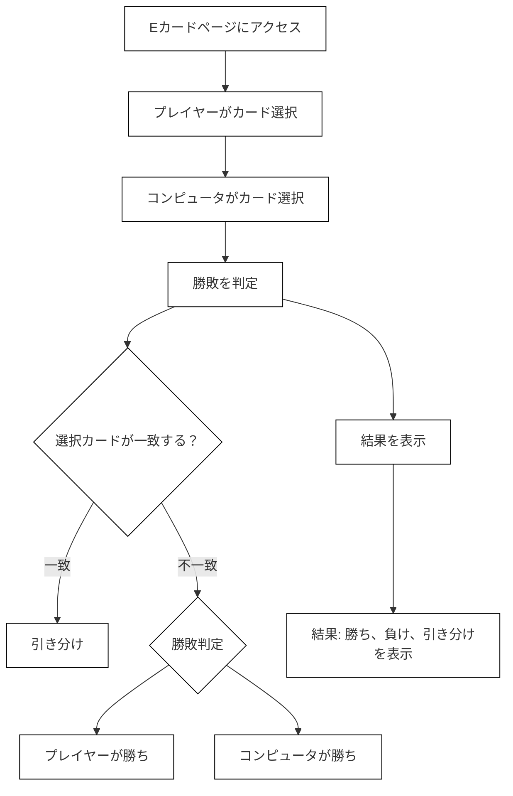

# webpro_06

## app5.jsについて
##　　起動方法
・必要な環境　Node.js
  1.リポジトリのクローン
```
git clone https://github.com/username/app5.git
cd app5
```
 2.パッケージのインストール
 ```
 npm install
 ```

 3.サーバーの起動
 ```
node app5.js

 ```
## 機能一覧
機能 | 説明　| 手順
-|-|-|
Hello World ページ (/hello1, /hello2)  | 「Hello world」や「Bon jour」のような挨拶を表示する | /hello1 または /hello2 にアクセスする(http://localhost:8080/hello1),(http://localhost:8080/hello2)。どちらの URL でも同じメッセージ（Hello world と Bon jour）が表示される。
アイコン表示 (/icon) |　Appleのロゴ画像を表示する。　|/icon(http://localhost:8080/icon) にアクセスする。ロゴ画像 (Apple_logo_black.svg)が表示されるページが表示される。
運勢占い (/luck) |　ランダムで運勢（大吉、中吉など）を決定し、その結果を表示する | /luck(http://localhost:8080/luck) にアクセスする。ページにランダムに選ばれた運勢（大吉、中吉など）が表示される。
じゃんけんゲーム (/janken) |　プレイヤーがじゃんけんの手を選び、コンピュータと対戦する。| (http://localhost:8080/janken)でアクセスする。hand はユーザーの手（グー、チョキ、パー）で、win と total はゲームの結果（勝ち数と試行回数）。プレイヤーの手とコンピュータの手が対戦し、結果（勝ち、負け、引き分け）が表示される。
Eカード (/ecard) | プレイヤーとコンピュータがカード（「皇帝」「市民」「奴隷」）を使って対戦する。| (http://localhost:8080/ecard)にアクセスする。card パラメータでプレイヤーのカードを指定できます。プレイヤーとコンピュータがカードを選び、勝敗が決まる。カードの選択には「皇帝」「市民」「奴隷」がある。
クイズ (/quiz と /quiz/result) | クイズを表示し、正解か不正解かを判定する。| (http://localhost:8080/quiz)にアクセスします。クイズが表示され、ユーザーは回答を選択する。クイズの答えをURLパラメータとして送信する。送信された答えが正解か不正解かを判定し、その結果を表示する。

##　フローチャート（Eカード）

##　git管理
1.コミット対象として選択
```
git add .
```
2.変更をコミット
```
git commit -m "変更内容"
```
3.リポジトリへのプッシュ
```
git push
```

[githubへ←←←](https://github.com/watanabe10GOD/webpro_06/blob/main/app5.js)


