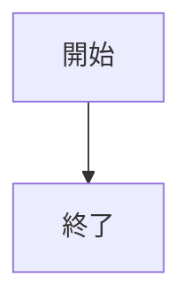
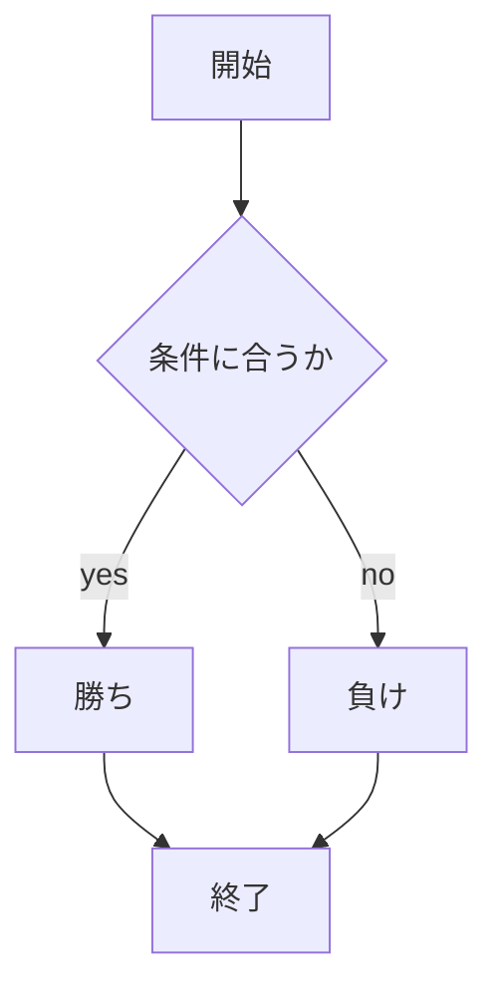

# webpro_06

## このプログラムについて

## ファイル一覧
ファイル名 | 説明
-|-
app.js  | 'Hello, World' を出力
app2.js |　テンプレートエンジンを使用
app3.js |　テンプレートを使ってHTMLを作成
app4.js |　おみくじゲーム
app5.js | プログラム本体
public/janken.html | じゃんけんの開始画面


[githubへ←←←](https://github.com/watanabe10GOD/webpro_06/blob/main/app5.js)

- リスト1
- リスト2
- リスト3

## ソースコード
```
const express = require("express");
const app = express();

app.set('view engine', 'ejs');
app.use("/public", express.static(__dirname + "/public"));

app.get("/hello1", (req, res) => {
  const message1 = "Hello world";
  const message2 = "Bon jour";
  res.render('show', { greet1: message1, greet2: message2 });
});

app.get("/hello2", (req, res) => {
  res.render('show', { greet1: "Hello world", greet2: "Bon jour" });
});

app.get("/icon", (req, res) => {
  res.render('icon', { filename: "./public/Apple_logo_black.svg", alt: "Apple Logo" });
});

app.get("/luck", (req, res) => {
  const num = Math.floor(Math.random() * 6 + 1);
  let luck = '';
  if (num == 1) luck = '大吉';
  else if (num == 2) luck = '中吉';
  console.log('あなたの運勢は' + luck + 'です');
  res.render('luck', { number: num, luck: luck });
});

app.get("/janken", (req, res) => {
  let hand = req.query.hand;
  let win = Number(req.query.win);
  let total = Number(req.query.total);
  console.log({ hand, win, total });
  
  const num = Math.floor(Math.random() * 3 + 1);
  let cpu = '';
  if (num == 1) cpu = 'グー';
  else if (num == 2) cpu = 'チョキ';
  else cpu = 'パー';


  let judgement = '';
  if (hand === cpu) {
    judgement = '引き分け';
  } else if (
    (hand === 'グー' && cpu === 'チョキ') ||
    (hand === 'チョキ' && cpu === 'パー') ||
    (hand === 'パー' && cpu === 'グー')
  ) {
    judgement = '勝ち';
    win += 1;
  } else {
    judgement = '負け';
  }
  
  total += 1;

  const display = {
    your: hand,
    cpu: cpu,
    judgement: judgement,
    win: win,
    total: total
  };
  
  res.render('janken', display);
});

app.listen(8080, () => console.log("Example app listening on port 8080!"));
```


